# 美味轩在线订餐系统 - 前端项目

> 一个基于 Vue 3 + Element Plus 的现代化餐厅在线订餐系统前端应用

## 项目简介

这是一个功能完善的餐厅在线订餐系统前端项目，采用 Vue 3 生态系统构建，提供用户端和管理端双重界面。项目实现了从浏览菜单、加入购物车、下单支付到订单管理的完整业务流程，同时为管理员提供了数据统计、菜品管理、订单管理等后台功能。

## 项目亮点

- **现代化技术栈**：Vue 3 Composition API + Vite + Pinia + Vue Router 4
- **组件化开发**：高度模块化的组件设计，代码复用性强
- **状态管理**：使用 Pinia 进行全局状态管理，数据流清晰
- **路由守卫**：完善的权限控制和路由拦截机制
- **响应式设计**：适配多种设备屏幕尺寸
- **用户体验优化**：流畅的页面交互和友好的错误提示

## 技术栈

### 核心框架
- **Vue 3.5.13** - 渐进式 JavaScript 框架
- **Vite 6.3.5** - 新一代前端构建工具
- **Vue Router 4.5.1** - 官方路由管理器
- **Pinia 3.0.2** - Vue 官方状态管理库

### UI 组件库
- **Element Plus 2.9.10** - 基于 Vue 3 的组件库
- **Font Awesome** - 图标库

### 数据可视化
- **ECharts 5.6.0** - 数据统计图表展示

### HTTP 请求
- **Axios 1.9.0** - Promise 基础的 HTTP 客户端

### 地图服务
- **高德地图 API** - 店铺位置展示

## 项目结构

```
front/
├── public/                 # 静态资源
│   ├── fontawesome/       # 字体图标
│   └── images/            # 公共图片
├── src/
│   ├── api/               # API 接口封装
│   │   ├── http.js       # Axios 实例配置
│   │   ├── authApi.js    # 认证相关接口
│   │   ├── dishApi.js    # 菜品相关接口
│   │   ├── cartApi.js    # 购物车接口
│   │   ├── orderApi.js   # 订单接口
│   │   └── adminApi.js   # 管理员接口
│   ├── assets/            # 资源文件
│   │   ├── css/          # 样式文件
│   │   ├── images/       # 图片资源
│   │   └── styles/       # 全局样式
│   ├── components/        # 公共组件
│   │   ├── TheHeader.vue      # 头部导航
│   │   ├── TheFooter.vue      # 底部信息
│   │   ├── DishCard.vue       # 菜品卡片
│   │   ├── CartItem.vue       # 购物车项
│   │   ├── CartSummary.vue    # 购物车汇总
│   │   ├── CategoryList.vue   # 分类列表
│   │   └── OrderStatus.vue    # 订单状态
│   ├── router/            # 路由配置
│   │   └── index.js      # 路由定义和守卫
│   ├── store/             # 状态管理
│   │   ├── auth.js       # 认证状态
│   │   └── cart.js       # 购物车状态
│   ├── views/             # 页面组件
│   │   ├── Home.vue           # 首页
│   │   ├── Menu.vue           # 菜单页
│   │   ├── DishDetail.vue     # 菜品详情
│   │   ├── Cart.vue           # 购物车
│   │   ├── Checkout.vue       # 结算页
│   │   ├── Orders.vue         # 订单列表
│   │   ├── OrderDetail.vue    # 订单详情
│   │   ├── Profile.vue        # 个人中心
│   │   ├── Login.vue          # 用户登录
│   │   ├── Register.vue       # 用户注册
│   │   ├── Activity.vue       # 优惠活动
│   │   ├── About.vue          # 关于我们
│   │   ├── Contact.vue        # 联系我们
│   │   └── admin/             # 管理后台页面
│   │       ├── AdminLogin.vue     # 管理员登录
│   │       ├── Dashboard.vue      # 管理面板
│   │       ├── Statistics.vue     # 数据统计
│   │       ├── CategoryManage.vue # 分类管理
│   │       ├── DishManage.vue     # 菜品管理
│   │       ├── OrderManage.vue    # 订单管理
│   │       └── UserManage.vue     # 用户管理
│   ├── App.vue            # 根组件
│   └── main.js            # 入口文件
├── index.html             # HTML 模板
├── vite.config.js         # Vite 配置
└── package.json           # 项目依赖
```

## 核心功能

### 用户端功能

#### 1. 首页展示
- 轮播图展示餐厅特色菜品
- 热门菜品推荐
- 优惠活动入口
- 餐厅简介

#### 2. 菜单浏览
- 按分类筛选菜品
- 菜品搜索功能
- 菜品详情查看
- 价格和描述展示

#### 3. 购物车管理
- 添加/删除菜品
- 修改菜品数量
- 实时计算总价
- 清空购物车

#### 4. 订单流程
- 订单结算
- 配送信息填写
- 订单提交
- 订单状态跟踪
- 历史订单查看

#### 5. 用户中心
- 个人信息管理
- 订单历史记录
- 收货地址管理

#### 6. 用户认证
- 用户注册
- 用户登录
- JWT Token 认证
- 自动登录状态保持

### 管理端功能

#### 1. 数据统计
- 订单统计图表（ECharts）
- 销售额统计
- 用户增长趋势
- 热门菜品排行

#### 2. 分类管理
- 分类增删改查
- 分类排序

#### 3. 菜品管理
- 菜品增删改查
- 菜品图片上传
- 菜品状态管理
- 库存管理

#### 4. 订单管理
- 订单列表查看
- 订单状态更新
- 订单详情查看
- 订单搜索筛选

#### 5. 用户管理
- 用户列表查看
- 用户状态管理
- 用户信息查询

## 🎨 界面展示

### 用户端界面

#### 首页
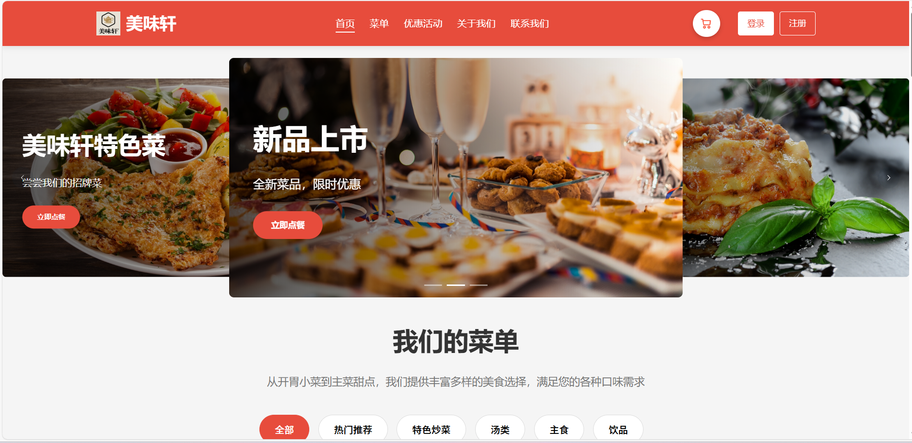
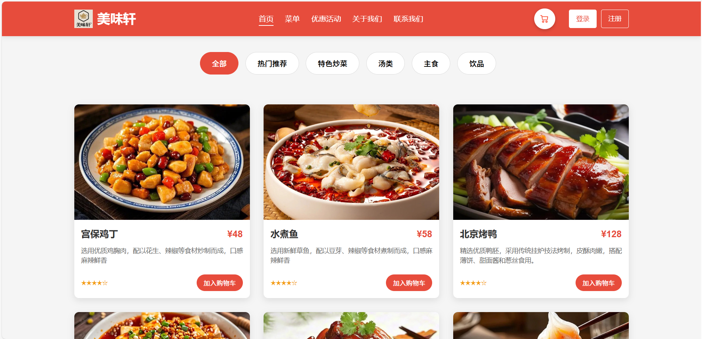
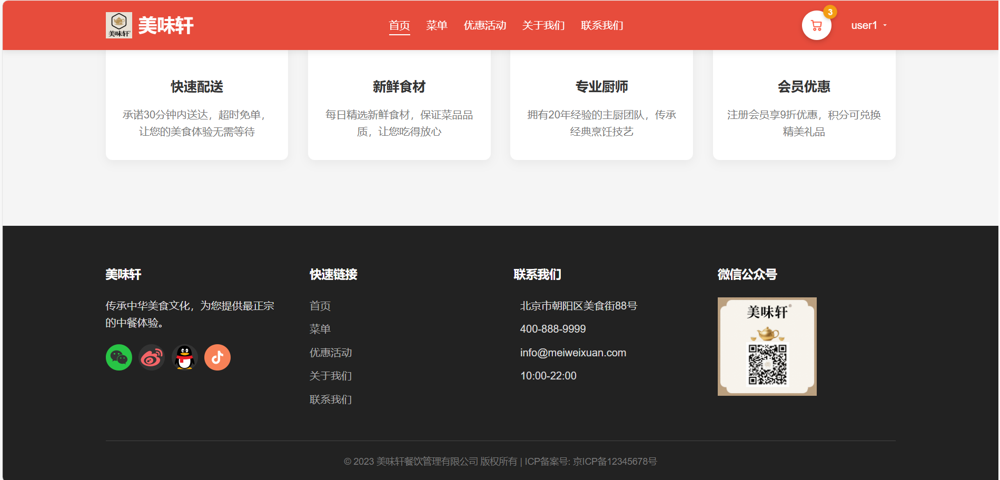

#### 菜单页面
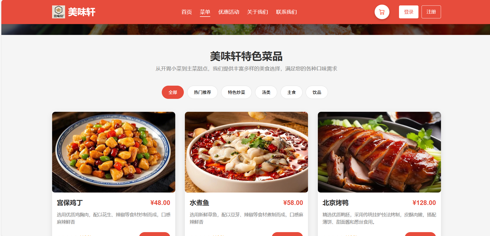

#### 购物车
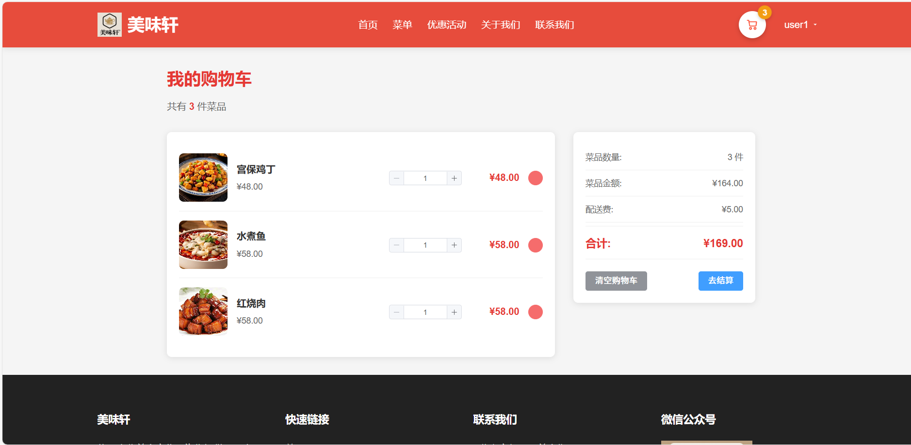

#### 订单中心
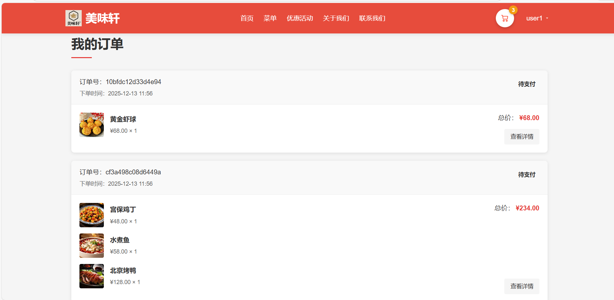

#### 个人中心
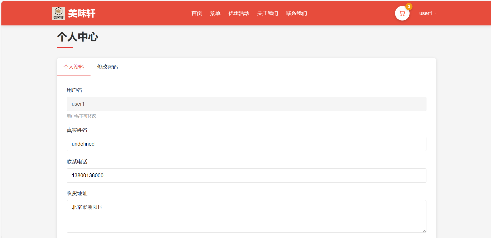

#### 优惠活动
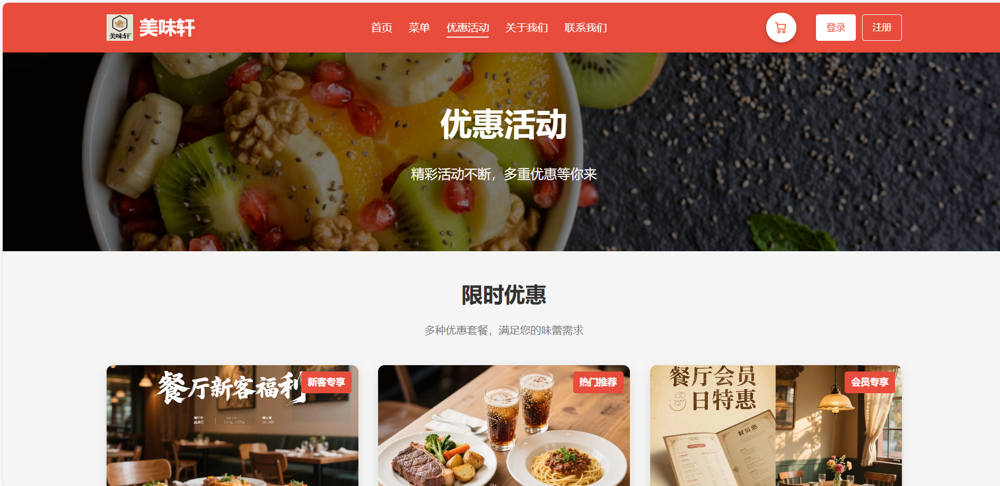

#### 关于我们
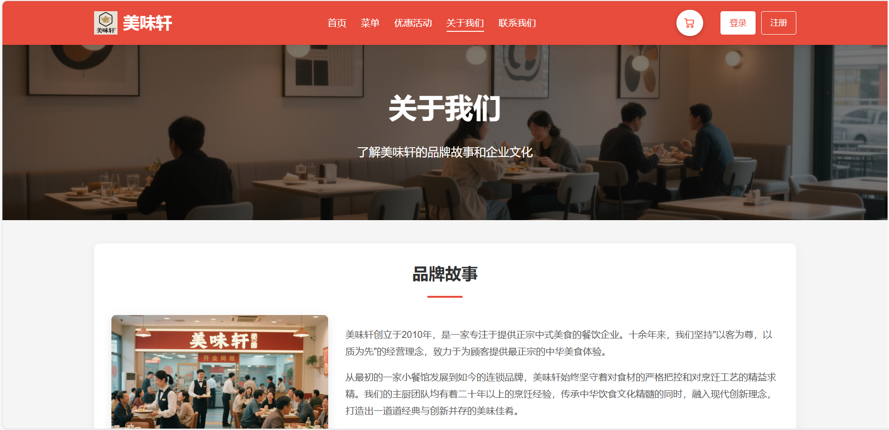
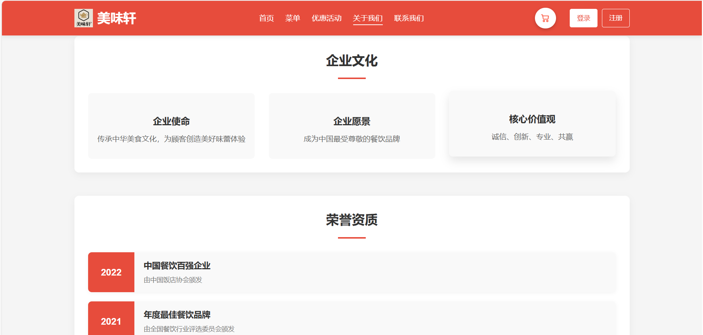

#### 用户登录
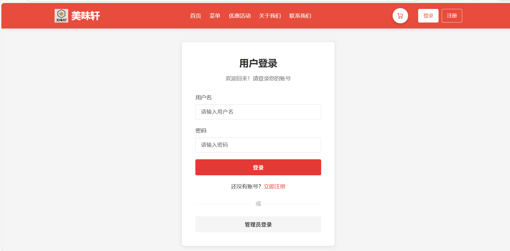

#### 用户注册
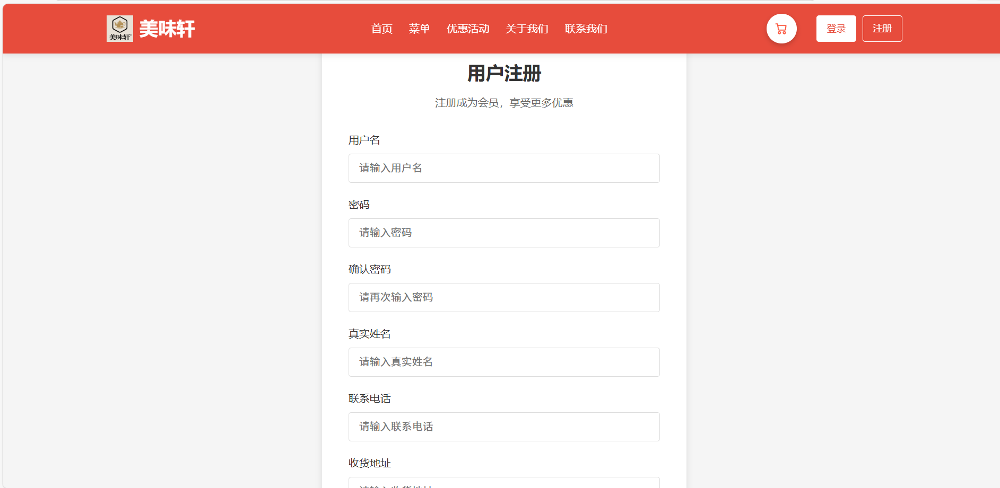

### 管理端界面

#### 数据统计
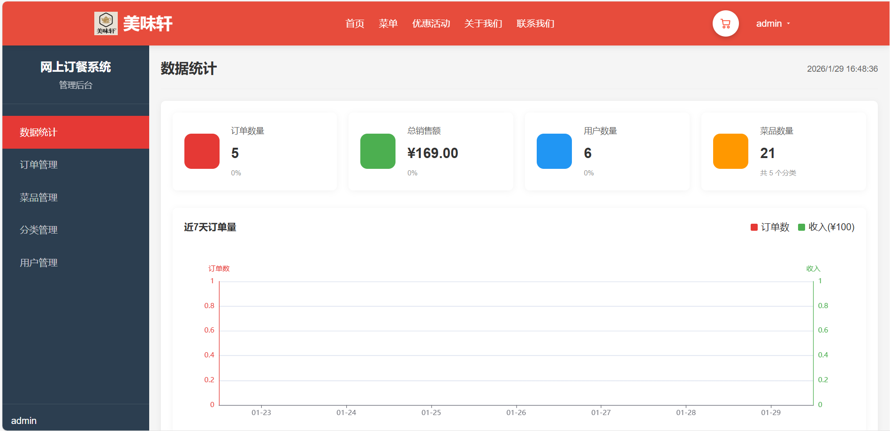

#### 分类管理
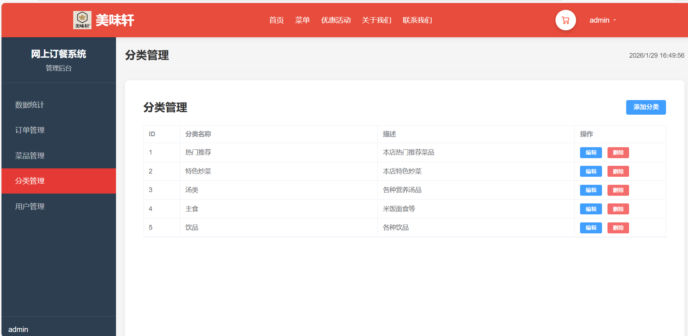

#### 菜品管理
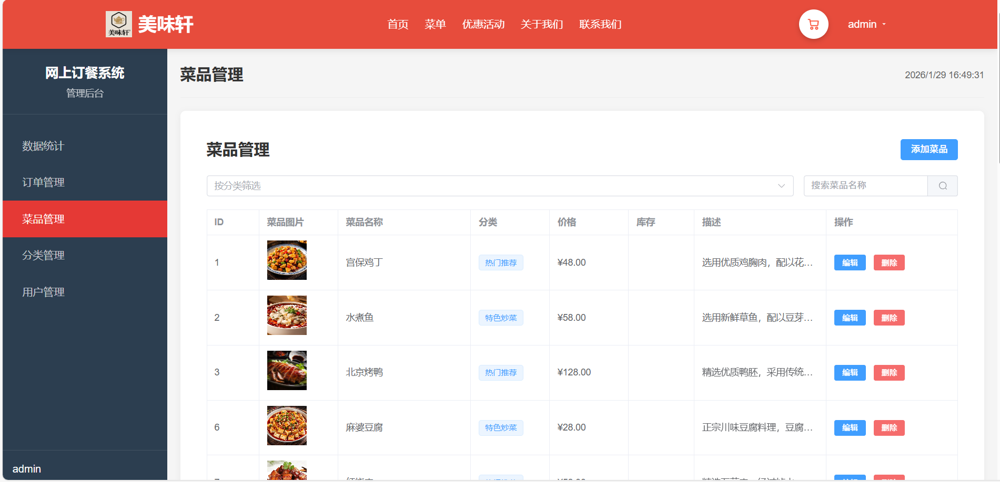

#### 订单管理
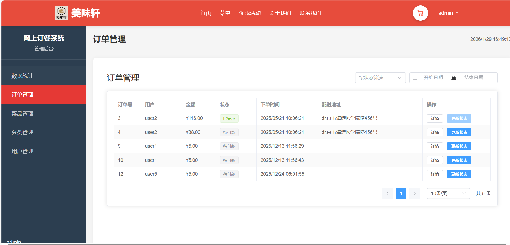

#### 用户管理
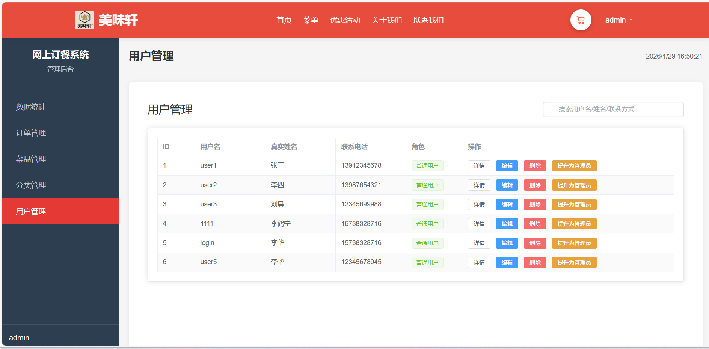

## 🚀 快速开始

### 环境要求
- Node.js >= 16.0.0
- npm >= 8.0.0 或 yarn >= 1.22.0

### 安装依赖
```bash
cd front
npm install
# 或
yarn install
```

### 开发环境运行
```bash
npm run dev
# 或
yarn dev
```

访问 http://localhost:5173

### 生产环境构建
```bash
npm run build
# 或
yarn build
```

### 预览生产构建
```bash
npm run preview
# 或
yarn preview
```

## 配置说明

### API 代理配置
在 `vite.config.js` 中配置了开发环境的 API 代理：

```javascript
server: {
  proxy: {
    '/api': {
      target: 'http://localhost:8082',  
      changeOrigin: true,
      secure: false
    }
  }
}
```

### 路由配置
- 使用 HTML5 History 模式
- 实现了路由守卫进行权限控制
- 支持路由懒加载优化性能

### 状态管理
- 使用 Pinia 进行状态管理
- 持久化存储用户登录状态
- 购物车状态实时同步

## 💡 核心技术实现

### 1. 认证机制
- JWT Token 认证
- Token 存储在 localStorage
- 请求拦截器自动添加 Token
- 响应拦截器处理 401 未授权

### 2. 路由守卫
```javascript
router.beforeEach((to, from, next) => {
  // 检查是否需要登录
  if (to.meta.requiresAuth && !authStore.isLoggedIn) {
    next('/login')
    return
  }
  
  // 检查是否需要管理员权限
  if (to.meta.requiresAdmin && !authStore.isAdmin) {
    next('/404')
    return
  }
  
  next()
})
```

### 3. HTTP 请求封装
- Axios 实例统一配置
- 请求/响应拦截器
- 错误统一处理
- Loading 状态管理

### 4. 组件通信
- Props / Emit 父子组件通信
- Pinia Store 跨组件状态共享
- Event Bus（必要时）

### 5. 性能优化
- 路由懒加载
- 图片懒加载
- 组件按需引入
- 代码分割

## 开发规范

### 代码风格
- 使用 ES6+ 语法
- 组件采用 Composition API
- 遵循 Vue 3 官方风格指南

### 命名规范
- 组件名：PascalCase（如 `TheHeader.vue`）
- 文件名：kebab-case 或 PascalCase
- 变量名：camelCase
- 常量名：UPPER_SNAKE_CASE

### 目录规范
- `components/` - 可复用组件
- `views/` - 页面级组件
- `api/` - API 接口
- `store/` - 状态管理
- `assets/` - 静态资源

## 权限控制

### 用户权限
- 游客：可浏览首页、菜单、活动等公开页面
- 普通用户：可使用购物车、下单、查看订单等功能
- 管理员：可访问后台管理系统

### 路由权限
```javascript
meta: {
  requiresAuth: true,      // 需要登录
  requiresAdmin: true      // 需要管理员权限
}
```

## 项目特色

1. **完整的业务流程**：从用户注册、浏览菜品、加入购物车到下单支付的完整闭环
2. **双端设计**：用户端和管理端分离，各司其职
3. **现代化架构**：采用最新的 Vue 3 生态系统，代码简洁高效
4. **良好的用户体验**：流畅的交互动画，友好的错误提示
5. **可扩展性强**：模块化设计，易于维护和扩展


